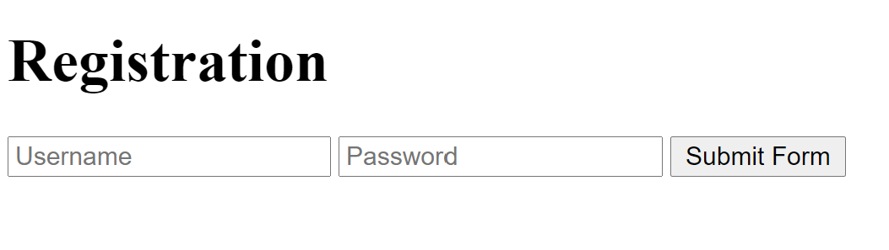
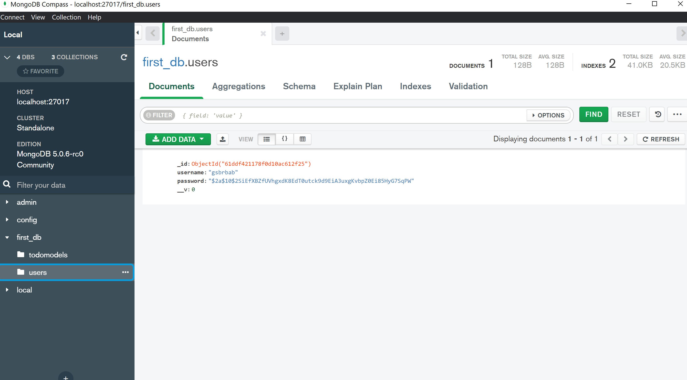

# node-auth-youtube

Part 2 of the <a href="https://codedamn.com/learn/node-mongodb-fundamentals">Learn MongoDB with Node.js</a> course from Codedamn. In this part we create an Express app and use the
<a href="https://jwt.io/">JWT</a> library to securely register and authenticate users, storing the information in a MongoDB database.

Once again we make use of Mongoose to enforce the user model database schema, and establish a CRUD model such that operations performed in the frontend are reflected in the user
database.

The pictures below depict a sketch the final working example:

  